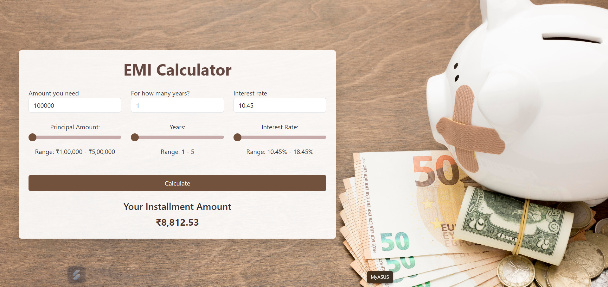

<h1>EMI Calculator</h1>

This is a responsive EMI (Equated Monthly Installment) Calculator built using React. The application allows users to input loan amounts, interest rates, and loan durations to calculate their monthly installments in real-time.

<h2>Preview</h2>

<em>Screenshot of the EMI Calculator application with a wooden background theme.</em>

<h2>Features</h2>

<ul>
  <li><strong>Real-time Calculation</strong>: Instantly updates the monthly installment amount as you adjust the loan parameters.</li>
  <li><strong>Responsive Design</strong>: Optimized for both desktop and mobile viewing.</li>
  <li><strong>Customizable Range Sliders</strong>: Sliders are styled to match the theme, with a wooden background that gives the app a professional look.</li>
  <li><strong>Modern UI</strong>: The calculator has a clean, modern interface that is both visually appealing and easy to use.</li>
</ul>

